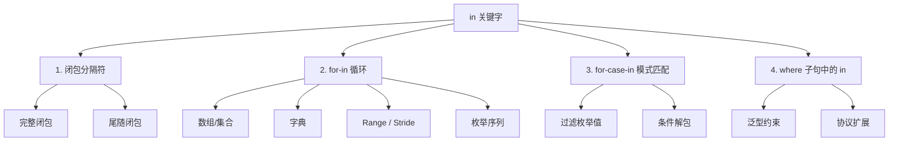

## 概述

`in` 是 Swift 中出现频率最高的关键字之一，但它**在不同上下文中含义完全不同**。本文梳理 `in` 关键字在 Swift 中的所有用法，帮你建立完整的认知地图。

---

## 总览：`in` 的 4 大使用场景



---

## 一、闭包中的 `in`（详细版见专项笔记）

闭包中 `in` 的作用是**分隔签名和实现**：

```swift
{ (参数声明) -> 返回类型 in
    执行语句
}
```

### 快速回顾

```swift
// 完整闭包 —— 有 in
let add = { (a: Int, b: Int) -> Int in
    return a + b
}

// 命名参数省略类型 —— 有 in
let add2 = { a, b in a + b }

// 简写参数 $0 —— 无 in
let add3 = { $0 + $1 }
```

> 📖 闭包中 `in` 的详尽用法参见 [Swift 闭包中 in 关键字详解](./closures-in-keyword.md)

---

## 二、`for-in` 循环

`for`-`in` 是 `in` 最常见的用法，用于**遍历任何遵循 `Sequence` 协议**的类型。

### 基本语法

```swift
for 临时常量 in 可遍历对象 {
    循环体
}
```

这里的 `in` 表示 **「从...中取出」**（取元素出来），与闭包中的分隔符完全不同。

### 2.1 遍历数组

```swift
let fruits = ["🍎", "🍌", "🍊"]

for fruit in fruits {
    print(fruit)
}
// 🍎
// 🍌
// 🍊
```

### 2.2 遍历字典

```swift
let scores = ["Alice": 95, "Bob": 87, "Carol": 92]

for (name, score) in scores {
    print("\(name): \(score)")
}
// 顺序不保证：Alice: 95, Bob: 87, Carol: 92
```

### 2.3 遍历 Range

```swift
// 闭区间
for i in 1...5 {
    print(i)  // 1 2 3 4 5
}

// 开区间
for i in 1..<5 {
    print(i)  // 1 2 3 4
}
```

### 2.4 遍历字符串（Swift 中 String 是 Sequence）

```swift
let word = "Swift"

for char in word {
    print(char)
}
// S
// w
// i
// f
// t
```

### 2.5 不需要循环变量时用 `_`

```swift
for _ in 1...3 {
    print("Hello")
}
// Hello
// Hello
// Hello
```

### 2.6 Stride（带步长）

```swift
// 递增
for i in stride(from: 0, to: 10, by: 2) {
    print(i)  // 0 2 4 6 8（不含 10）
}

// 递减
for i in stride(from: 10, through: 0, by: -2) {
    print(i)  // 10 8 6 4 2 0
}
```

### 2.7 enumerated() 获取索引

```swift
for (index, item) in fruits.enumerated() {
    print("\(index): \(item)")
}
// 0: 🍎
// 1: 🍌
// 2: 🍊
```

### 2.8 zip 并行遍历

```swift
let names = ["Alice", "Bob", "Carol"]
let scores = [95, 87, 92]

for (name, score) in zip(names, scores) {
    print("\(name): \(score)")
}
// Alice: 95
// Bob: 87
// Carol: 92
```

### 2.9 forEach 方法（不是 `for-in`）

```swift
// forEach 使用的是闭包，in 是闭包分隔符，不是循环语义
fruits.forEach { fruit in
    print(fruit)
}

// 两者语义差异：forEach 中不能使用 break/continue
// for-in 中可以用 break/continue
```

:::warning `for-in` vs `forEach` 的区别

| | `for-in` | `forEach` |
|------|:---:|:---:|
| `break` / `continue` | ✅ 可用 | ❌ 不可用 |
| `return` 行为 | 跳出外层函数 | 仅跳出当前闭包（等同于 `continue`） |
| 底层 | 语言级控制流 | 高阶函数（接收闭包） |
| `in` 的含义 | 遍历 | 闭包分隔符 |

:::

---

## 三、`for-case-in` 模式匹配

这是 `for-in` 的高级变体，在遍历的同时**进行模式匹配过滤**。

### 基本语法

```swift
for case 模式 in 序列 where 条件 {
    // 只有匹配成功的元素才会进入循环体
}
```

### 3.1 遍历枚举数组并过滤特定 case

```swift
enum Result {
    case success(Int)
    case failure(String)
}

let results: [Result] = [
    .success(100),
    .failure("Network error"),
    .success(200),
    .failure("Timeout"),
]

// 只遍历 success 并提取关联值
for case .success(let value) in results {
    print("成功值: \(value)")
}
// 成功值: 100
// 成功值: 200
```

### 3.2 配合 `where` 子句

```swift
for case .success(let value) in results where value > 150 {
    print("高价值成功: \(value)")
}
// 高价值成功: 200
```

### 3.3 遍历可选数组并过滤 nil

```swift
let mixed: [Int?] = [1, nil, 3, nil, 5]

// 只遍历非 nil 值
for case let value? in mixed {
    print(value)  // 1 3 5
}

// 等价于
for case .some(let value) in mixed {
    print(value)  // 1 3 5
}
```

### 3.4 类型转换过滤

```swift
let objects: [Any] = [1, "Hello", 3.14, "World", 42]

// 只遍历 String 类型
for case let str as String in objects {
    print(str.uppercased())
}
// HELLO
// WORLD
```

### 3.5 `where` 条件的完整能力

`where` 可以用在任何 `for-in` 之后（不限于 `case`）：

```swift
let numbers = [1, 2, 3, 4, 5, 6, 7, 8]

// 普通 for-in + where
for i in numbers where i.isMultiple(of: 2) {
    print(i)  // 2 4 6 8
}

// 等价于
for i in numbers {
    guard i.isMultiple(of: 2) else { continue }
    print(i)
}
```

---

## 四、`where` 子句中的上下文

`where` 子句经常与 `in` 出现在同一行，但它们各司其职：

```swift
for item in collection where condition { }
//       ^^              ^^^^^
//       in（遍历）       where（过滤）
//       两者独立，互不替代
```

### 4.1 泛型约束中的 `where`（此场景无 `in`）

```swift
// 泛型 where 子句不涉及 in 关键字
func allItemsMatch<C1: Collection, C2: Collection>(
    _ c1: C1, _ c2: C2
) -> Bool where C1.Element == C2.Element, C1.Element: Equatable {
    // ...
}
```

### 4.2 协议扩展中的 `where`（此场景无 `in`）

```swift
extension Array where Element: Numeric {
    func sum() -> Element {
        reduce(0, +)
    }
}
```

---

## 五、`in` 在各场景中的语义对比

| 场景 | 语法 | `in` 的含义 | 类比 |
|------|------|:---|------|
| 闭包 | `{ x in x * 2 }` | **分隔符**：签名结束，实现开始 | 英文 "in the body, do..." |
| `for-in` | `for x in array` | **从...中**：从集合中取元素 | 英文 "for each x **in** the collection" |
| `for-case-in` | `for case .a(let v) in arr` | **从...中** + 模式匹配 | `for-in` 的过滤版本 |
| `where` 在循环 | `for x in arr where x > 0` | 依然是遍历语义，`where` 是附加过滤 | SQL 的 `WHERE` |

---

## 六、常见误区

### 误区 1：`for-in` 的 `in` 和闭包的 `in` 是一样的

```swift
// ❌ 错误理解：这两个 in 是同一个东西
for item in items { }        // in = "从集合中取"
items.forEach { item in }    // in = "闭包参数声明结束"

// ✅ 正确理解：它们只是拼写相同，语义和位置不同
```

### 误区 2：`forEach` 可以用 `break`

```swift
// ❌ 编译错误
items.forEach { item in
    if item == target { break }  // 'break' is only allowed inside a loop
}

// ✅ 应改用 for-in
for item in items {
    if item == target { break }
}
```

### 误区 3：`for-case-in` 的 `in` 是个新关键字组合

`for-case-in` 不是三元关键字，而是：
- `for` — 循环关键字
- `case 模式` — 模式匹配
- `in` — 还是「从...中遍历」

```swift
for                    // 1. 循环开始
    case .success(let v)  // 2. 匹配模式
    in                  // 3. 从哪个集合遍历
    results             // 4. 集合
{ }                    // 5. 循环体
```

### 误区 4：认为所有 `in` 都可以省略

```swift
// 闭包中可以省略（用 $0 替代命名参数）
{ $0 < $1 }           // ✅ 无 in

// for-in 中绝对不能省略
for item items { }    // ❌ 编译错误
for item in items { } // ✅ 必须写 in
```

---

## 七、完整速查表

```swift
// ─── 1. 闭包分隔符 ─────
{ (a: Int) -> Int in return a * 2 }      // in = "实现开始"
{ (a: Int) in return a * 2 }             // 省略返回类型
{ a, b in a + b }                        // 省略所有类型 + 隐式返回
{ $0 + $1 }                              // 简写参数 → in 消失
{ }                                      // 无参数无返回值 → 无 in

// ─── 2. for-in 遍历 ─────
for i in 1...5 { }                       // in = "从范围中"
for item in array { }                    // in = "从数组中"
for (k, v) in dict { }                   // in = "从字典中"
for _ in 0..<3 { }                       // 忽略循环变量
for (i, v) in arr.enumerated() { }       // 带索引
for (a, b) in zip(xs, ys) { }            // 并行遍历
for i in stride(from: 0, to: 10, by: 2)  // 带步长

// ─── 3. for-case-in 模式匹配 ─────
for case .some(let v) in arr { }         // 匹配枚举
for case let v? in arr { }               // 过滤 nil（可选）
for case let s as String in arr { }      // 类型过滤
for case .some(let v) in arr where v > 0 // combine where

// ─── 4. where 子句配合 ─────
for item in arr where item > 0 { }       // where 过滤，in 仍是遍历
```

---

## 总结

| 用法的数量 | 具体场景 |
|:---:|---|
| **1 个核心分隔符** | 闭包：签名 `in` 实现 |
| **1 个核心遍历义** | `for` ... `in` 序列（含 `for-case-in`） |
| **0 个新义** | `where` 是搭配 `for-in` 的过滤子句，`in` 本身不变 |

**一句话记忆法：**

> 看见 `{ }` 里的 `in` → 闭包分隔符  
> 看见 `for` 后的 `in` → 遍历集合  
> 看见 `for case` 后的 `in` → 遍历 + 模式匹配
