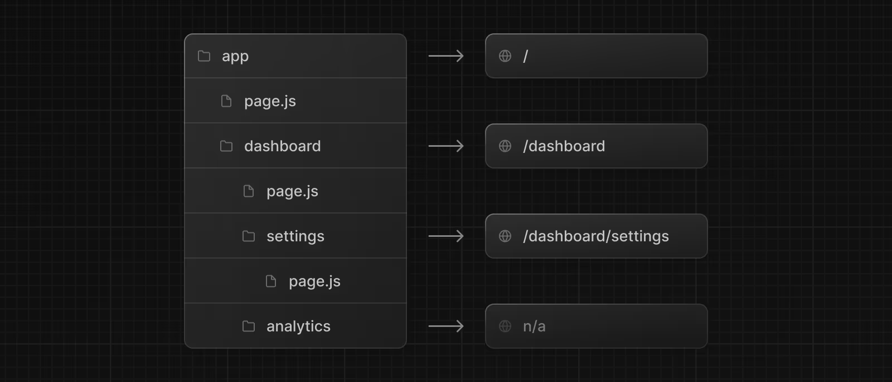

# 基础概念

## 路由

从 app 目录开始，每个文件夹生成一级路口。其中每一层的 page.js 代表了根路径 `/`。
如果不包含 page.js 则无根目录。



::: caution
在next.js中 `js` `ts` `tsx` 都可以用在这里。
:::

## Layouts

在每一层文件夹下的 layout.js 文件中的组件，会包裹整个文件夹中所有别的组件。

在顶级 `app` 中的 layout.js 作为最顶层的 layout 将包裹整个 DOM，所以其中包含 `<html>` `<body>`。

每个layout是嵌套包裹的，和文件夹的嵌套关系一致。


```tsx app/layout.tsx
export default function RootLayout({
                                     children,
                                   }: {
  children: React.ReactNode
}) {
  return (
    <html lang="en">
    <body>
    <main>{children}</main>
    </body>
    </html>
  )
}
```

## Template

Template 和 Layout 异曲同工，他会处于 layout 下方，并且包裹文件夹下所有组件。


主要区别：Template 会在每次子路由变换后重新卸载挂载，意味着template组件里面的状态会随路由变化而重制。但是layout组件只会被挂载一次，如果根路由没变的话。