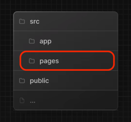

# Next.Js Pages Router

NextJs 的 pages 文件夹相比于 app 文件夹来说相对简单。

先来看目录结构。



## 路由

pages 文件夹根目录对应根路由，根目录里的 index.tsx 会对应到路由 `/`。
里面的每个子文件对应下一级路由，例如 `dashboard` 文件夹下的组件 `index.tsx` 就会被渲染到路由的 `/dashboard`。

### 动态路由

我们可以命名 `/blog/[id].tsx` 来接收路由的动态参数。这样路由 `/blog/1`, 在 `[id].tsx` 组件中就能接收到 `{ id: '1' }`。

```tsx
import { useRouter } from 'next/router'

const Blob = () => {
  const router = useRouter()
  return <p>Post: {router.query.id} </p>
}

export default Blob;
```

当让你可以接住很多 query 参数 `[...id].tsx`

| URL         | Params                    |
|-------------|---------------------------|
| /blob/1/2/3 | `{ id: ['1', '2', '3'] }` |
| /blob/1     | `{ id: ['1'] }`           |

也可让 query 参数可选 `[[...id]].tsx`

| URL     | Params              |
|---------|---------------------|
| /blob   | `{ id: undefined }` |
| /blob/1 | `{ id: ['1'] }`     |

## Custom App

作为page router里最有意思的一个特性 `_app.tsx`。

Next.Js 使用 `APP` 组件来初始化每一个 page，我们可以重写这个组件！**这个组件全局只能有一个。**

```tsx pages/_app.tsx
import type { AppProps } from "next/app";

const LeanNextJsApp = ({ Component, pageProps }: AppProps) => {
  return (
    <>
      <Component {...pageProps} />
    </>)
}

export default LeanNextJsApp
```

这个组件就有意思了，作为整个应用最顶层的组件。
每次路由变化的时候，该路由对应的 component 在被渲染之前，都会被传入这个组件。也就意味着，可以控制宣布渲染这个组件，或者是怎么渲染这个组件。

首先我们可以在这里添加自定义的 `<head>` `<script>` 到 HTML 里。

```tsx pages/_app.tsx
import type { AppProps } from "next/app";
import Script from "next/script";
import Head from "next/head";

const LeanNextJsApp = ({ Component, pageProps }: AppProps) => {
  return (
    <>
      <Head>
        ...html header
      </Head>
      <Script>
        ...script
      </Script>
      <Component {...pageProps} />
    </>)
}

export default LeanNextJsApp
```

我们可以为组件添加而外的属性，来决定对组建的渲染

```tsx pages/_app.tsx
import type { AppProps } from "next/app";

export type NextPageWithKey<P = {}, IP = P> = NextPage<P, IP> & {
  key: string
}

type AppPropsWithKey = AppProps & { Component: NextPageWithKey }

const LeanNextJsApp = ({ Component, pageProps }: AppPropsWithKey) => {

  // ...Get valied root key from api
  if (!Component?.key || !valiedKey.include(Component.key)) {
    return <NotFound />
  }
  return (
    <>
      <Component {...pageProps} />
    </>)
}

export default LeanNextJsApp
```

```tsx pages/other-pages.tsx
import type { NextPageWithKey } from "@/pages/_app";

const BlobA: NextPageWithKey = () => {
  return <div>Blob A</div>
}

BlobA.key = "blobA"

export default BlobA
```

## Custom Error

```tsx pages/404.js
export default function Custom404() {
  return <h1>404 - Page Not Found</h1>
}
```


