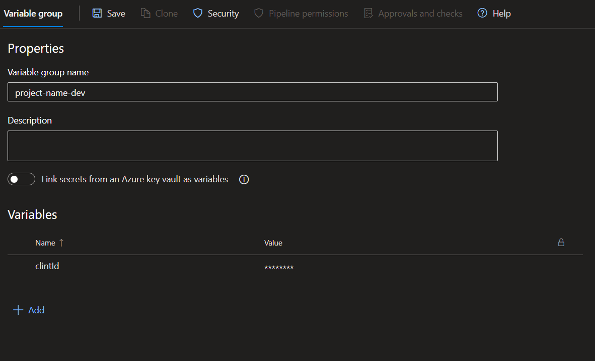
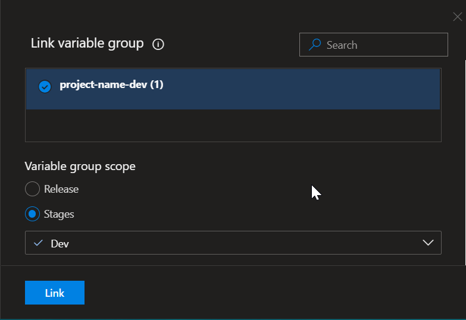
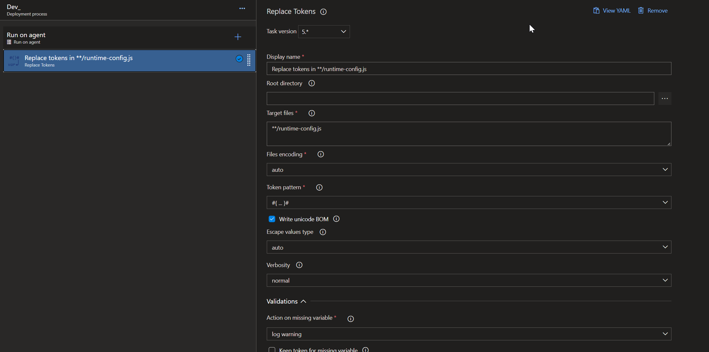

# 前端的环境变量

## Process Env

在正常的开发流程中，通常会经历Development/Acceptance(Test)/Production阶段，可能你会想在不同的环境做不同的事，或是给同一个变量赋不同的值。

后端代码获得环境变量的方法非常简单，只用在不同的环境下读取不同的配置文件，或者是读取操作系统定义的环境变量即可。

可是前端代码是运行在浏览上的我们如何去读取环境变量呢？

通常使用现代框架 (React/Vue) 的前端程序员在开发代码的时候，都会用到webpack，前端的环境变量其实是在webpack打包的时候被定义的。

通常，在我们启动开发服务器的时候 `npm run start` webpack将 `process.env.NODE_ENV` 打包为`development`，而我们在运行 `npm run build` 的是时候 webpack 把 `process.env.NODE_ENV` 打包为 `production`。

:::caution

`process`并不是一个对象，`process.env`也不是一个对象，如果你写出如下语句`console.log(process.env)`你会得到一个`process undefined`错误。
但是你写出`console.log(process.env.NODE_ENV)`你会得到一个字符串。是什么如此神器？事实上在webpack打包的时候，webpack自动把`process.env.NODE_ENV`替换成`"development"`了。

:::

## Config.js

例用以上特性就可以实现在开发的时候和打包之后运行不同的代码或者给同一个变量赋不同的值

```ts
const config = process.env.NODE_ENV === "developemt" ? DEV_CONFIG : PROD_CONFIG;
process.env.NODE_ENV === "developemt" ? funcDev(): funcProd();
```

但是这远远还不够，在一个大的开发团队中，三个环境都需要打包，并运行在不同的机器上进行，这种情况下如何配置不同的变量呢？

我们可以在public文件夹下创建一个配置文件

```js title="public/runtime-config.js"
window[config] = {
  clintId: "xxxx"
}
```

```html title="public/index.html"
<html>
<head>
  <script src="%PUBLIC_URL%/runtime-config.js"></script>
</head>
</html>
```

```ts title="Any File"
const clintId = (window as any).config.clintId;
```

public/runtime-config.js 在打包之后会被放到打包文件的跟目录下，而写在头里的script会优先运行我们的config文件，将我们的config对象挂到window上，这样后续的代码就能拿到config对象的了。

我们只需要去到不同机器上修改runtime-config.js就可以对不同的环境应用不同的变量了。

## CI/CD

当然在运用CI/CD的项目中我们就可以省去手动更改的步骤了，结合上述两种方法在CD的过程中直接替换Config里的变量就可以了。

```js title="public/runtime-config.js"
window[config] = {
  clintId: "#{clintID}#"
}
```

```html title="public/index.html"
<html>
<head>
  <script src="%PUBLIC_URL%/runtime-config.js"></script>
</head>
</html>
```

```ts title="any file"
const clintId = process.env.NODE_ENV === "development" ? "xxx" : (window as any).config.clintId;
```

这样在本地开发服务器运行的时候，我们获得的clintID永远是"xxx"，而在设置部署CD的时候，我们根据不同的环境替换掉`runtime-config.js`中的`#{clintId}#`就可以了。

部署到服务器之后，我们会去读取不同环境挂在window上的不同配置。

不同CD工具有不同的配置方法，一下已Azure DevOps为例

首先在`Pipelines->Library`下创建Variable group，并写入当前环境下的key-value



在Releases中构建CD的时候引用该Group到当前部署阶段



在CD中使用replace tokens替换变量




